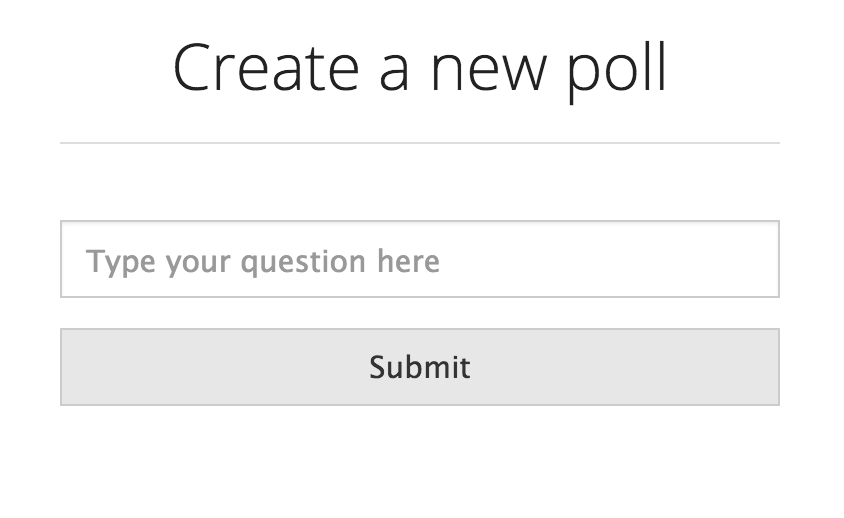
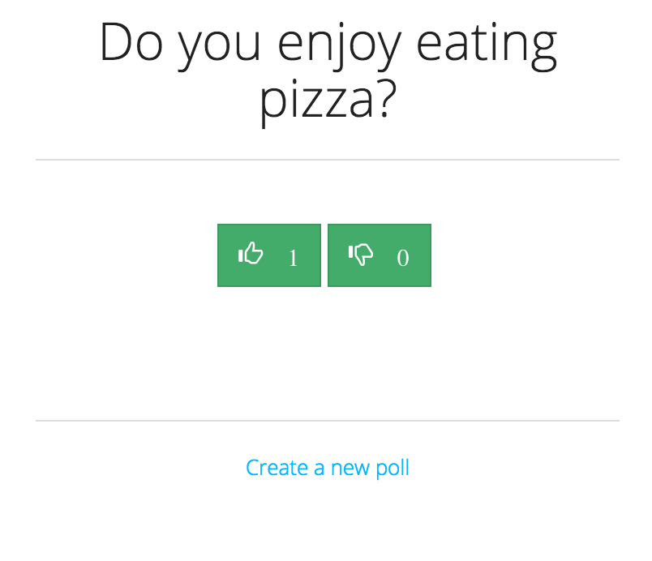

# Straw Poll

[](https://travis-ci.org/mjhea0/straw-poll)
[](https://coveralls.io/github/mjhea0/straw-poll?branch=master)

Straw Poll is a basic, real-time polling app, for thumbing up or down.

## Getting Started

1. Fork/Clone
1. Install dependencies - npm install
1. Rename the *.env_sample* file to *.env* and update
1. Create two local Postgres databases - `Straw_poll` and `Straw_poll_test`
1. Migrate - `knex migrate:latest --env development`
1. Seed - `knex seed:run --env development`
1. Run the development server - `gulp`

## Test

Without code coverage:

```sh
$ npm test
```

With code coverage:

```sh
$ npm run coverage
```

## Todo

1. Test socket.io
1. e2e tests

## Images



